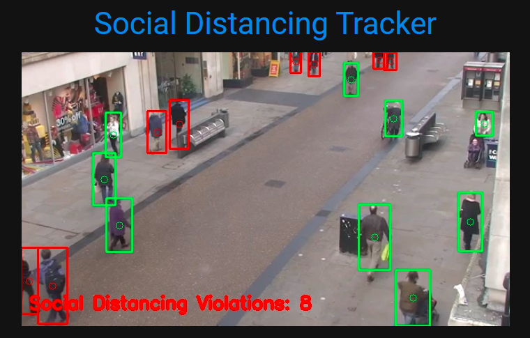

## Blockchain-Managed Crowd Social Distancing Detector w/ Computer Vision
BlockLAB @ Maxonrow Hackathon
https://platform-hackathon.maxonrow.com/#/event

## Problem Statement
To slow the spread of COVID-19, a tamper-proof, trustworthy, and privacy-enabled detection system is required to track and maintain social distancing. However, current systems in place lack consistent contact tracing, contain privacy concerns, and are vulnerable to corrupted data.

## Our Solution
We propose a social distancing detection model that records contact tracing data about certain locations with crowds, as well as distances between individuals. We also propose a blockchain-based data integrity validation tool to mitigate some of the concerns of with the use of AI technology, through a hybrid on and off-chain system. Information from our application is stored to a blockchain ledger to preserve data integrity and remove the risks of data tampering, or corruption. This data can be used for analytics to detect locations vulnerable to future outbreaks and enable swift action to enforce social-distancing guidelines in these areas.

## How it works
1. <b>Build Computer Vision Detector </b>\
We implement a YOLO detection model to accurately and consistently identify individuals not following social-distancing guidelines. The strictness of the guidelines can be adjusted accordingly.
2. <b>Incorporate Blockchain Storage </b>\
The use of blockchain ledgers and smart contracts preserve the integrity of the data and allows for easy analysis of social distancing practices throughout different locations.
3. <b>Deploy and Monitor Social Distancing </b>\
Deploying the detection model to video feed of webcams and record social distancing. The detections made by the model are flowing through the blockchain and good/bad distancing are recorded.

## Screenshots


## How to use
Navigate to the src folder and run main.py (Use --help to see the full list of options): 
```
python main.py --input "static/test.mp4" --location "San Diego"
```
The application will be running on: http://localhost:8000
